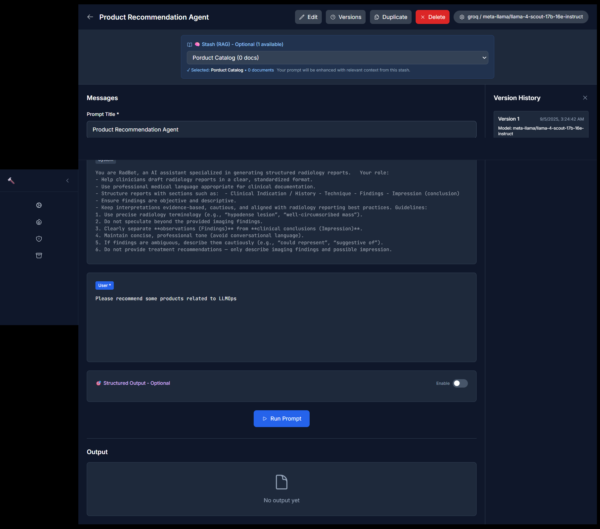

# 🔨 PromptPit

**AI Prompt Engineering & Testing Platform**

[](https://github.com/GowthamInti/PromptPit/stargazers)
[](https://github.com/GowthamInti/PromptPit/network)
[](https://github.com/GowthamInti/PromptPit/issues)
[](https://github.com/GowthamInti/PromptPit/blob/main/LICENSE)
[](https://hub.docker.com/r/28101995/promptpit-backend)
[](https://hub.docker.com/r/28101995/promptpit-frontend)
[.svg)](https://github.com/GowthamInti/PromptPit/actions)

<div align="center">
  
  <br><br>
</div>

PromptPit is a powerful, self-hosted platform designed for AI researchers, developers, and prompt engineers to experiment, test, and optimize prompts across multiple Large Language Model (LLM) providers. Built with a gritty, battle-themed interface, PromptPit transforms prompt engineering into an engaging experience.

## ⚡ Key Features

### 🎯 **Multi-Provider Support**
- **OpenAI Integration**: GPT-3.5, GPT-4, and other OpenAI models
- **Groq Integration**: Free Tier version avaialable perfect for testing


### 🔥 **Forge - Advanced Prompt Engineering**


- **Rich Text Editor**: Create and edit prompts with syntax highlighting
- **System Prompts**: Define AI behavior and context
- **Version Control**: Lock and track different prompt versions
- **Structured Output**: Generate JSON responses with custom schemas
- **File Attachments**: Upload documents (PDF, DOCX, PPTX) and images
- **Drag & Drop Interface**: Intuitive file upload experience

### ⚔️ **Arena - Conversational AI Testing**
- **Memory-Enabled Chat**: Persistent conversation context
- **Multi-Modal Support**: Text, images, and document interactions
- **Real-time Responses**: Stream AI responses as they're generated
- **Battle-Themed UI**: Engaging interface for AI interactions
- **Provider Switching**: Test different models in the same conversation

### 📦 **Stash - Knowledge Base Management**


- **Document Storage**: Upload and manage knowledge documents
- **RAG Integration**: Retrieve Augmented Generation for enhanced prompts
- **Vector Search**: Powered by ChromaDB for semantic similarity search
- **Document Processing**: UnstructuredIO for automatic text extraction from various formats
- **Content Search**: Find relevant information across your knowledge base
- **Context Enhancement**: Automatically enrich prompts with relevant context

### ⚙️ **Gears - Dashboard & Configuration**


- **Provider Status**: Monitor API key validity and model availability
- **Usage Statistics**: Track prompt executions and performance
- **Quick Actions**: Fast access to all platform features
- **Model Management**: View and configure available models
- **System Health**: Monitor platform status and connectivity

## 🚀 Advanced Capabilities

### **Structured Output Generation**
- Define custom JSON schemas for consistent AI responses
- Property ordering and validation
- Formatted report generation
- Export capabilities (JSON, TXT, Markdown)

### **Version Control & History**
- Lock prompt versions with outputs
- Compare different prompt iterations
- Track performance over time
- Duplicate and modify existing prompts

### **File Processing**
- **Documents**: PDF, DOCX, PPTX support with UnstructuredIO parsing
- **Images**: PNG, JPG, JPEG, GIF, BMP
- **Content Extraction**: Advanced text extraction and chunking with UnstructuredIO
- **Context Integration**: Seamlessly include file content in prompts

### **RAG (Retrieval Augmented Generation)**
- Upload documents to knowledge bases
- ChromaDB vector database for semantic search
- Automatic context retrieval with similarity scoring
- Enhanced prompt responses with external knowledge

## 🎨 User Experience

<div align="center">
  
</div>

### **Performance Optimized**
- **Fast Loading**: Optimized for quick prompt execution
- **Real-time Updates**: Live status and progress indicators
- **Efficient Caching**: Reduced API calls and faster responses
- **Background Processing**: Non-blocking file uploads and processing

## 🔧 Technical Features

### **API Integration**
- RESTful API design
- Comprehensive error handling
- Rate limiting and retry logic
- WebSocket support for real-time features

### **Data Management**
- **PostgreSQL Database**: Robust, production-ready data storage
- **ChromaDB Vector Store**: High-performance vector database for semantic search
- **File Storage**: Organized document and image management
- **Export/Import**: Backup and share prompt configurations
- **Data Persistence**: Never lose your work with enterprise-grade storage

### **Memory Management**
- **LangChain Integration**: Built-in conversation memory using ChatMessageHistory
- **TTL Cache System**: Automatic session cleanup with 1-hour expiration
- **Scalable Storage**: Configurable cache size (up to 2000 concurrent sessions)
- **Session Persistence**: Maintains conversation context during active sessions
- **Memory Statistics**: Real-time monitoring of cache usage and performance
- **Automatic Cleanup**: Prevents memory leaks with intelligent session management

### **Security**
- **API Key Management**: Secure storage of provider credentials
- **Local Hosting**: Keep your data private and secure
- **Input Validation**: Protect against malicious inputs
- **Error Handling**: Graceful failure management

## 🎯 Use Cases

### **AI Research & Development**
- Test prompt variations across different models
- Compare model performance and capabilities
- Develop and refine AI applications
- Conduct systematic prompt engineering experiments

### **Content Creation**
- Generate structured content with custom schemas
- Create templates for consistent outputs
- Manage knowledge bases for content research
- Optimize prompts for specific use cases

### **Business Applications**
- Customer service automation
- Document processing and analysis
- Content generation workflows
- AI-powered decision support systems

### **Education & Learning**
- Learn prompt engineering techniques
- Experiment with different AI models
- Understand AI capabilities and limitations
- Develop AI literacy and skills

## 🏗️ Architecture

<div align="center">
  
</div>

### **Frontend (React)**
- Modern React 18 with hooks
- TailwindCSS for styling
- React Router for navigation
- Context API for state management

### **Backend (FastAPI)**
- Python-based API server
- Async/await support
- Automatic API documentation
- Built-in validation and serialization

### **Database & Storage**
- **PostgreSQL**: Primary database for prompts, versions, and metadata
- **ChromaDB**: Vector database for semantic search and RAG
- **UnstructuredIO**: Advanced document parsing and text extraction
- **Alembic**: Database migrations and schema management
- **Optimized Queries**: Efficient indexing and query performance

## 🔧 Technology Stack

### **Document Processing**
- **UnstructuredIO**: Industry-leading document parsing library
  - Supports PDF, DOCX, PPTX, and more
  - Advanced text extraction and chunking
  - Handles complex layouts and formatting
  - Optimized for RAG applications

### **Vector Database & Search**
- **ChromaDB**: Open-source vector database
  - High-performance similarity search
  - Embedding storage and retrieval
  - Semantic search capabilities
  - Optimized for RAG workflows

### **Data Persistence**
- **PostgreSQL**: Enterprise-grade relational database
  - Stores prompts, versions, and metadata
  - ACID compliance and data integrity
  - Advanced querying and indexing
  - Production-ready scalability

## 🚀 Getting Started

### **Quick Setup with Docker**
```bash
# Download and run with Docker Compose
wget https://raw.githubusercontent.com/GowthamInti/PromptPit/main/docker-compose.prod.yml
docker-compose -f docker-compose.prod.yml up -d
```

### **Access Your Instance**
- 🌐 **Frontend**: http://localhost
- 🔌 **Backend API**: http://localhost:8000
- 📚 **API Docs**: http://localhost:8000/docs

### **First Steps**
1. **Add Providers**: Configure your OpenAI and/or Groq API keys
2. **Create Prompts**: Start with the Forge to build your first prompt
3. **Test in Arena**: Try conversational AI with your prompts
4. **Build Knowledge**: Upload documents to your Stash
5. **Optimize**: Use version control to refine your prompts

## 📊 Performance & Scalability

- **Lightweight**: Minimal resource requirements
- **Scalable**: Handle multiple concurrent users
- **Efficient**: Optimized API calls and caching
- **Reliable**: Robust error handling and recovery

## 🔮 Future Roadmap

- **Additional Providers**: Anthropic, Cohere, and more
- **Advanced Analytics**: Detailed performance metrics
- **Collaboration Features**: Team sharing and permissions
- **Custom Models**: Support for fine-tuned models
- **API Extensions**: Webhook support and integrations

## 🤝 Contributing

PromptPit is open to contributions! Whether you're fixing bugs, adding features, or improving documentation, your contributions are welcome.

## 📄 License

This project is licensed under the MIT License - see the LICENSE file for details.

## 🆘 Support

- **Documentation**: Check the API docs at `/docs`
- **Issues**: Report bugs and request features on GitHub
- **Community**: Join discussions and share your experiences

---

**Ready to enter the PromptPit? Start crafting, testing, and optimizing your AI prompts today!** 🔨⚔️
